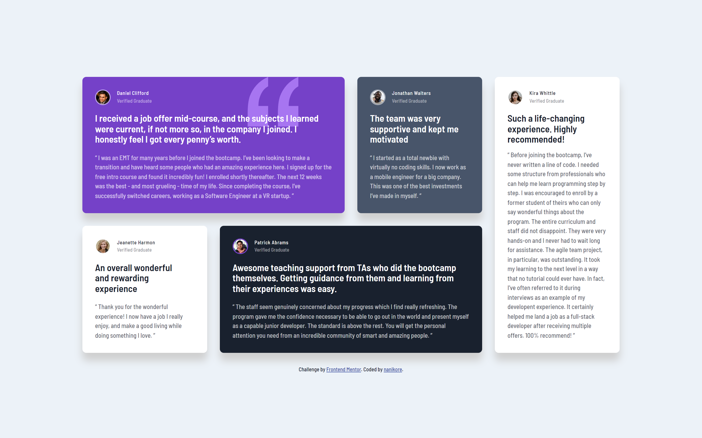

# Frontend Mentor - Testimonials grid section solution

This is a solution to the [Testimonials grid section challenge on Frontend Mentor](https://www.frontendmentor.io/challenges/testimonials-grid-section-Nnw6J7Un7). Frontend Mentor challenges help you improve your coding skills by building realistic projects.

## Table of contents

- [Overview](#overview)
  - [The challenge](#the-challenge)
  - [Screenshot](#screenshot)
  - [Links](#links)
- [My process](#my-process)
  - [Built with](#built-with)
  - [What I learned](#what-i-learned)
  - [Useful resources](#useful-resources)
- [Author](#author)

## Overview

### The challenge

Users should be able to:

- View the optimal layout for the site depending on their device's screen size

### Screenshot

### Links

- [Solution URL](https://www.frontendmentor.io/solutions/testimonials-grid-section-solution-1RYytiGxcW)
- [Live Site URL](https://cdguilherme.github.io/testimonials-grid-section-main/)

## My process

### Built with

- Semantic HTML5 markup
- CSS custom properties
- Flexbox
- CSS Grid
- Mobile-first workflow
- [SASS](https://sass-lang.com/) - For styles

### What I learned

Responsive Grid Layout and SASS.

### Useful resources

- [Learn CSS Grid - A 13 Minute Deep Dive](https://www.youtube.com/watch?v=EiNiSFIPIQE)
- [CSS grid-template Property](https://www.w3schools.com/cssref/pr_grid-template.php)
- [CSS grid-area Property](https://www.w3schools.com/cssref/pr_grid-area.php)

## Author

- GitHub - [Guilherme Costa](https://github.com/cdGuilherme)
- Frontend Mentor - [@cdGuilherme](https://www.frontendmentor.io/profile/cdGuilherme)

## Acknowledgments

Thanks [Gwenaël Magnenat](https://www.frontendmentor.io/profile/gmagnenat) for giving feedback on the code!
